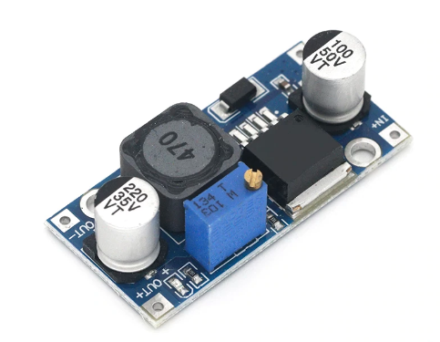

# Бесполезная коробка

## Цель проекта:

1. Сделать игрушку для дочки
2. Разобраться с линеймым приводом на базе шагового двигателя
3. Повеселить себя

## Структурная схема проекта:

 


## Копаненты:


1. [Кнопки](https://aliexpress.ru/item/10pcs-Mini-12mm-Toggle-Rocker-Switch-6-Pins-2-Position-3-Position-ON-OFF-ON-OFF/4000238840867.html?spm=a2g0s.9042311.0.0.264d33edreTiCg&_ga=2.268409480.721664696.1612051115-530682806.1605135245&_gac=1.114393461.1610796936.CjwKCAiAuoqABhAsEiwAdSkVVCUs5nTX80VVDpcnxLvB3kZpXs2zuaedRuR_P9vpGu__abLf1sHESBoCMw4QAvD_BwE):  
2. [Шаговый двигатель NEMA 17](https://aliexpress.ru/item/4000329570564.html?spm=a2g0o.productlist.0.0.550816d5g7iG02&s=p&ad_pvid=202102171649262241762909808400006084000_1&algo_pvid=74b4ed5f-48ea-4d00-8ceb-39b771c87547&algo_expid=74b4ed5f-48ea-4d00-8ceb-39b771c87547-0&btsid=0b8b15cb16136093662915169e17f0&ws_ab_test=searchweb0_0,searchweb201602_,searchweb201603_):  
3. [Направляющая MGN7H 300mm](https://aliexpress.ru/item/MGN7-MGN12-MGN15-MGN9-L-100-200-350-500-600-800mm-miniature-linear-rail-slide-1pcs/4000264234020.html?spm=a2g0s.9042311.0.0.264d33edV28rk1&_ga=2.58105772.721664696.1612051115-530682806.1605135245&_gac=1.52601434.1610796936.CjwKCAiAuoqABhAsEiwAdSkVVCUs5nTX80VVDpcnxLvB3kZpXs2zuaedRuR_P9vpGu__abLf1sHESBoCMw4QAvD_BwE):  
4. [зубчатый шкив GT2 Bore 5 width 6](https://aliexpress.ru/item/High-Quality-GT2-Timing-Pulley-20-teeth-Bore-5mm-8mm-Aluminum-2GT-Synchronous-Wheel-3D-Printer/4000898906136.html?spm=a2g0s.9042311.0.0.264d33edffujk0&_ga=2.61209386.721664696.1612051115-530682806.1605135245&_gac=1.82479716.1610796936.CjwKCAiAuoqABhAsEiwAdSkVVCUs5nTX80VVDpcnxLvB3kZpXs2zuaedRuR_P9vpGu__abLf1sHESBoCMw4QAvD_BwE)  
5. [Шкив GT2 20 без зубцов](https://aliexpress.ru/item/GT2-Pulley-16-20-Without-Teeth-Pulley-16-20Teeth-OR-without-Teeth-Timing-Gear-Bore-3MM/32512894329.html?spm=a2g0s.9042311.0.0.264d33edSwKw4B&_ga=2.61389354.721664696.1612051115-530682806.1605135245&_gac=1.16302788.1612302785.CjwKCAiAjeSABhAPEiwAqfxURVnAwRXYoBPZ3WxVAR4feCVnuMGysp3E3lEiteS4H-q8LJ6nynU2xxoCko8QAvD_BwE):   
6. \*\*\*\*[**Ремень ГРМ 6 мм**](https://aliexpress.ru/item/1m-2m-5m-10m-lot-GT2-6mm-open-timing-belt-width-6mm-GT2-belt-Rubber-Aramid/10000401582873.html?spm=a2g0s.9042311.0.0.264d33edk60mRf&_ga=2.67033000.721664696.1612051115-530682806.1605135245&_gac=1.84984299.1610796936.CjwKCAiAuoqABhAsEiwAdSkVVCUs5nTX80VVDpcnxLvB3kZpXs2zuaedRuR_P9vpGu__abLf1sHESBoCMw4QAvD_BwE) **** 
7. [разъём питания](https://www.aliexpress.com/item/32706948395.html?spm=a2g0o.placeorder.0.0.6a3729fdQrTPAv&mp=1&_ga=2.186203887.733649584.1612867822-530682806.1605135245&_gac=1.114402677.1612393293.CjwKCAiAsOmABhAwEiwAEBR0ZoQVOcgG0DaGH8qnhtB28t2LdHiSB6GSdQXWdLqeA8_Wg5yumM56ehoC7-UQAvD_BwE)   
8. [Плата расширения шагового двигателя DRV8825 A4988](https://aliexpress.ru/item/42-Stepper-Motor-Driver-Expansion-Board-DRV8825-A4988-3D-Printer-Parts-Control-Shield-Module-For-Arduino/4000772974580.html?spm=a2g0s.9042311.0.0.264d4c4dGZ6dwF&_ga=2.254851598.721664696.1612051115-530682806.1605135245&_gac=1.223396457.1612308157.CjwKCAiAjeSABhAPEiwAqfxURU6SgqMSpneTdudvHVfqPxbiaVtaGNwp5Z0pYRTR7Jnq-5hC8eiXThoCH3cQAvD_BwE&sku_id=10000007739648050):  
9. [Драйвер шагового двигателя DRV8825](https://aliexpress.ru/item/3D-Printer-Parts-StepStick-DRV8825-Stepper-Motor-Driver-With-Heat-sink-Carrier-Reprap-4-layer-PCB/32618856994.html?spm=a2g0s.9042311.0.0.264d4c4dGZ6dwF&_ga=2.237425158.721664696.1612051115-530682806.1605135245&_gac=1.119636730.1612308157.CjwKCAiAjeSABhAPEiwAqfxURU6SgqMSpneTdudvHVfqPxbiaVtaGNwp5Z0pYRTR7Jnq-5hC8eiXThoCH3cQAvD_BwE&sku_id=59319975710):  
10. \*\*\*\*[**Магнитный датчик AS5600**](https://aliexpress.ru/item/AS5600-magnetic-encoder-magnetic-induction-angle-measurement-sensor-module-12bit-high-precision/4000551682522.html?spm=a2g0s.9042311.0.0.264d33edTr0gcC&_ga=2.263126666.721664696.1612051115-530682806.1605135245&_gac=1.229861102.1612308157.CjwKCAiAjeSABhAPEiwAqfxURU6SgqMSpneTdudvHVfqPxbiaVtaGNwp5Z0pYRTR7Jnq-5hC8eiXThoCH3cQAvD_BwE&sku_id=10000002869296963)**:**  
11. [DC-DC регулятор напряжения](https://aliexpress.ru/item/33004374185.html?spm=a2g0o.productlist.0.0.63734940WFkuHK&algo_pvid=69b1ce41-6fe2-4ea3-9b8d-426b5a752cef&algo_expid=69b1ce41-6fe2-4ea3-9b8d-426b5a752cef-0&btsid=0b8b035c16138588368628898e0816&ws_ab_test=searchweb0_0,searchweb201602_,searchweb201603_&sku_id=67088944738):  [доп инфа](http://wiki.sunfounder.cc/index.php?title=Step-down_DC-DC_Converter_Module)
12. [Концевые выключатели:](https://aliexpress.ru/item/1005002095893731.html?spm=a2g0o.productlist.0.0.738c5adf1HHuBW&algo_pvid=881a52cb-539b-430d-be31-5b1113a0f7ba&algo_expid=881a52cb-539b-430d-be31-5b1113a0f7ba-2&btsid=0b8b035616123513749206658ebd18&ws_ab_test=searchweb0_0,searchweb201602_,searchweb201603_&sku_id=12000018727208471)  
13. [Блок питания 24 Вольта 100 Ват: MEAN WELL  LRS-100-24](https://aliexpress.ru/item/4000583760898.html?spm=a2g0o.cart.0.0.31273c00FpFe9I&mp=1&_ga=2.228498075.721664696.1612051115-530682806.1605135245&_gac=1.126968447.1612308157.CjwKCAiAjeSABhAPEiwAqfxURU6SgqMSpneTdudvHVfqPxbiaVtaGNwp5Z0pYRTR7Jnq-5hC8eiXThoCH3cQAvD_BwE):  
14. [Серва D3615](https://aliexpress.ru/item/32591892775.html?spm=a2g0o.productlist.0.0.64122326MxbxwF&algo_pvid=d103a923-3100-482d-b945-38f32df2212a&algo_expid=d103a923-3100-482d-b945-38f32df2212a-0&btsid=0b8b158f16123942747607896e3a4e&ws_ab_test=searchweb0_0,searchweb201602_,searchweb201603_):  

## Конструкция:

последняя версия модели[](https://cad.onshape.com/documents/125a385a616ec6f2df24a618/w/73a084dbbe324177ee5459c5/e/6f8e287a4627f32adfb02f55)

## Сборка стенда:





## Схема питания:

 


## Распиновка arduino nano:

 


[схема arduino Nano](https://www.arduino.cc/en/uploads/Main/ArduinoNano30Schematic.pdf)

## Плата расширения и финальная электрическая схема:

### Занятые порты arduino nano:


  


###  Обозначение разьёмов платы-расширения:

 


## Реализация платы расширениия:

 


## Пример кода проверки функционала:

```text
#include <AccelStepper.h>
#include <Servo.h>
#include <AS5600.h>

#define STEPS_PER_REVOLUTION 200 * 4
#define DIR_PIN 4
#define STEP_PIN 7
#define ENABLE_PIN 8

#define BUTTON_0 9
#define BUTTON_1 10
#define BUTTON_2 11
#define BUTTON_3 12
#define BUTTON_4 A0
#define BUTTON_5 13
#define BUTTON_6 A3
#define BUTTON_7 A2
#define BUTTON_8 A1

#define BUTTON_END_LEFT 2
#define BUTTON_END_RIGHT 3

#define SERVO_1 5
#define SERVO_2 6


static int buttons[] = {
	BUTTON_0, BUTTON_1, BUTTON_2, BUTTON_3, BUTTON_4, BUTTON_5,
	BUTTON_6,BUTTON_7, BUTTON_8, BUTTON_END_LEFT, BUTTON_END_RIGHT};

Servo servo_1;
Servo servo_2;
AccelStepper stepper(AccelStepper::DRIVER, STEP_PIN, DIR_PIN);


AS5600 encoder;
long revolutions = 0;	// number of revolutions the encoder has made
double position;		// the calculated value the encoder is at
double output;			// raw value from AS5600
long lastOutput;		// last output from AS5600

void setup() {
	// 0. setup serial
	Serial.begin(115200);

	//1. setup stepper driver
	pinMode(ENABLE_PIN, OUTPUT);
	digitalWrite(ENABLE_PIN, LOW);

	stepper.setMaxSpeed(3000 * 2);
	stepper.setAcceleration(5000 * 2);
	stepper.moveTo(STEPS_PER_REVOLUTION);

	//2. setup buttons
	for (int i = 0; i < sizeof(buttons)/ sizeof(buttons[0]); i++) {
		pinMode(buttons[i], INPUT_PULLUP); 
	}

	//3. init servos
	servo_1.attach(SERVO_1);
	servo_2.attach(SERVO_2);

	//4. init encoder
	output = encoder.getPosition();
	lastOutput = output;
	position = output;
}

void test_encoder() {
	// get the raw value of the encoder
	output = encoder.getPosition();

	// check if a full rotation has been made
	if ((lastOutput - output) > 2047 ) {
		revolutions++;
	}
	
	if ((lastOutput - output) < -2047 ) {
		revolutions--;
	}
	lastOutput = output; 

	// calculate the position the the encoder is at based off of the number of revolutions
	position = (revolutions * 4096 + output) / 4096. * 360;
	Serial.println(position);
}

void test_buttons() {
	unsigned short button_mask = 0;
	for (int i = 0; i < sizeof(buttons)/ sizeof(buttons[0]); i++) {
		button_mask = button_mask | (digitalRead(buttons[i]) ? 1 : 0) << i;
	}
	// Serial.println(button_mask, BIN);
}

void test_stepper() {
	if (stepper.distanceToGo() == 0) {
		stepper.moveTo(-stepper.currentPosition());
	}
	stepper.run();
}

void test_servo() {
	static unsigned long start_time = millis();
	static char state = 0;

	unsigned long cur_time = millis();

	if (state == 0) {
		if ((cur_time - start_time) > 250) {
			servo_1.write(105);
			start_time = cur_time;
			state = 1;
		}
	} else {
		if ((cur_time - start_time) > 700) {
			servo_1.write(0);
			start_time = cur_time;
			state = 0;
		}
	}
}

void loop() {
	test_servo();
	test_buttons();
	test_stepper();
	test_encoder();
}
```

