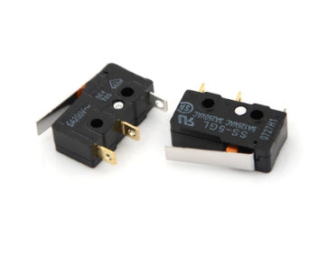

# Бесполезная коробка

## Цель проекта:

1. Сделать игрушку для дочки
2. Разобраться с линеймым приводом на базе шагового двигателя
3. Повеселить себя

## Структурная схема проекта:

 

## Копаненты:

1. [Кнопки](https://aliexpress.ru/item/10pcs-Mini-12mm-Toggle-Rocker-Switch-6-Pins-2-Position-3-Position-ON-OFF-ON-OFF/4000238840867.html?spm=a2g0s.9042311.0.0.264d33edreTiCg&_ga=2.268409480.721664696.1612051115-530682806.1605135245&_gac=1.114393461.1610796936.CjwKCAiAuoqABhAsEiwAdSkVVCUs5nTX80VVDpcnxLvB3kZpXs2zuaedRuR_P9vpGu__abLf1sHESBoCMw4QAvD_BwE):  
2. [Направляющая MGN7H 300mm](https://aliexpress.ru/item/MGN7-MGN12-MGN15-MGN9-L-100-200-350-500-600-800mm-miniature-linear-rail-slide-1pcs/4000264234020.html?spm=a2g0s.9042311.0.0.264d33edV28rk1&_ga=2.58105772.721664696.1612051115-530682806.1605135245&_gac=1.52601434.1610796936.CjwKCAiAuoqABhAsEiwAdSkVVCUs5nTX80VVDpcnxLvB3kZpXs2zuaedRuR_P9vpGu__abLf1sHESBoCMw4QAvD_BwE):  
3. [зубчатый шкив GT2 Bore 5 width 6](https://aliexpress.ru/item/High-Quality-GT2-Timing-Pulley-20-teeth-Bore-5mm-8mm-Aluminum-2GT-Synchronous-Wheel-3D-Printer/4000898906136.html?spm=a2g0s.9042311.0.0.264d33edffujk0&_ga=2.61209386.721664696.1612051115-530682806.1605135245&_gac=1.82479716.1610796936.CjwKCAiAuoqABhAsEiwAdSkVVCUs5nTX80VVDpcnxLvB3kZpXs2zuaedRuR_P9vpGu__abLf1sHESBoCMw4QAvD_BwE)  
4. [Шкив GT2 20 без зубцов](https://aliexpress.ru/item/GT2-Pulley-16-20-Without-Teeth-Pulley-16-20Teeth-OR-without-Teeth-Timing-Gear-Bore-3MM/32512894329.html?spm=a2g0s.9042311.0.0.264d33edSwKw4B&_ga=2.61389354.721664696.1612051115-530682806.1605135245&_gac=1.16302788.1612302785.CjwKCAiAjeSABhAPEiwAqfxURVnAwRXYoBPZ3WxVAR4feCVnuMGysp3E3lEiteS4H-q8LJ6nynU2xxoCko8QAvD_BwE):   
5. \*\*\*\*[**Ремень ГРМ 6 мм**](https://aliexpress.ru/item/1m-2m-5m-10m-lot-GT2-6mm-open-timing-belt-width-6mm-GT2-belt-Rubber-Aramid/10000401582873.html?spm=a2g0s.9042311.0.0.264d33edk60mRf&_ga=2.67033000.721664696.1612051115-530682806.1605135245&_gac=1.84984299.1610796936.CjwKCAiAuoqABhAsEiwAdSkVVCUs5nTX80VVDpcnxLvB3kZpXs2zuaedRuR_P9vpGu__abLf1sHESBoCMw4QAvD_BwE) **** 
6. [разъём питания](https://www.aliexpress.com/item/32706948395.html?spm=a2g0o.placeorder.0.0.6a3729fdQrTPAv&mp=1&_ga=2.186203887.733649584.1612867822-530682806.1605135245&_gac=1.114402677.1612393293.CjwKCAiAsOmABhAwEiwAEBR0ZoQVOcgG0DaGH8qnhtB28t2LdHiSB6GSdQXWdLqeA8_Wg5yumM56ehoC7-UQAvD_BwE)   
7. [Плата расширения шагового двигателя DRV8825 A4988](https://aliexpress.ru/item/42-Stepper-Motor-Driver-Expansion-Board-DRV8825-A4988-3D-Printer-Parts-Control-Shield-Module-For-Arduino/4000772974580.html?spm=a2g0s.9042311.0.0.264d4c4dGZ6dwF&_ga=2.254851598.721664696.1612051115-530682806.1605135245&_gac=1.223396457.1612308157.CjwKCAiAjeSABhAPEiwAqfxURU6SgqMSpneTdudvHVfqPxbiaVtaGNwp5Z0pYRTR7Jnq-5hC8eiXThoCH3cQAvD_BwE&sku_id=10000007739648050):  
8. [Драйвер шагового двигателя DRV8825](https://aliexpress.ru/item/3D-Printer-Parts-StepStick-DRV8825-Stepper-Motor-Driver-With-Heat-sink-Carrier-Reprap-4-layer-PCB/32618856994.html?spm=a2g0s.9042311.0.0.264d4c4dGZ6dwF&_ga=2.237425158.721664696.1612051115-530682806.1605135245&_gac=1.119636730.1612308157.CjwKCAiAjeSABhAPEiwAqfxURU6SgqMSpneTdudvHVfqPxbiaVtaGNwp5Z0pYRTR7Jnq-5hC8eiXThoCH3cQAvD_BwE&sku_id=59319975710):  
9. \*\*\*\*[**Магнитный датчик AS5600**](https://aliexpress.ru/item/AS5600-magnetic-encoder-magnetic-induction-angle-measurement-sensor-module-12bit-high-precision/4000551682522.html?spm=a2g0s.9042311.0.0.264d33edTr0gcC&_ga=2.263126666.721664696.1612051115-530682806.1605135245&_gac=1.229861102.1612308157.CjwKCAiAjeSABhAPEiwAqfxURU6SgqMSpneTdudvHVfqPxbiaVtaGNwp5Z0pYRTR7Jnq-5hC8eiXThoCH3cQAvD_BwE&sku_id=10000002869296963)**:**  
10. [DC-DC регулятор напряжения:](https://aliexpress.ru/item/1005001636420985.html?spm=a2g0o.productlist.0.0.2e5f2ab4XLcgwO&s=p&ad_pvid=2021020303174819329998777861500004103982_1&algo_pvid=29519d29-96ea-42de-a5cc-7033db299bcf&algo_expid=29519d29-96ea-42de-a5cc-7033db299bcf-0&btsid=0b8b035616123510689054629ebd18&ws_ab_test=searchweb0_0,searchweb201602_,searchweb201603_)  
11. [Концевые выключатели:](https://aliexpress.ru/item/1005002095893731.html?spm=a2g0o.productlist.0.0.738c5adf1HHuBW&algo_pvid=881a52cb-539b-430d-be31-5b1113a0f7ba&algo_expid=881a52cb-539b-430d-be31-5b1113a0f7ba-2&btsid=0b8b035616123513749206658ebd18&ws_ab_test=searchweb0_0,searchweb201602_,searchweb201603_&sku_id=12000018727208471)  
12. [Блок питания 24 Вольта 100 Ват: MEAN WELL  LRS-100-24](https://aliexpress.ru/item/4000583760898.html?spm=a2g0o.cart.0.0.31273c00FpFe9I&mp=1&_ga=2.228498075.721664696.1612051115-530682806.1605135245&_gac=1.126968447.1612308157.CjwKCAiAjeSABhAPEiwAqfxURU6SgqMSpneTdudvHVfqPxbiaVtaGNwp5Z0pYRTR7Jnq-5hC8eiXThoCH3cQAvD_BwE):  
13. [Серва D3615](https://aliexpress.ru/item/32591892775.html?spm=a2g0o.productlist.0.0.64122326MxbxwF&algo_pvid=d103a923-3100-482d-b945-38f32df2212a&algo_expid=d103a923-3100-482d-b945-38f32df2212a-0&btsid=0b8b158f16123942747607896e3a4e&ws_ab_test=searchweb0_0,searchweb201602_,searchweb201603_):  

## Конструкция:

последняя версия модели

## Сборка стенда:





## Схема питания:

 

## Прошивка:

