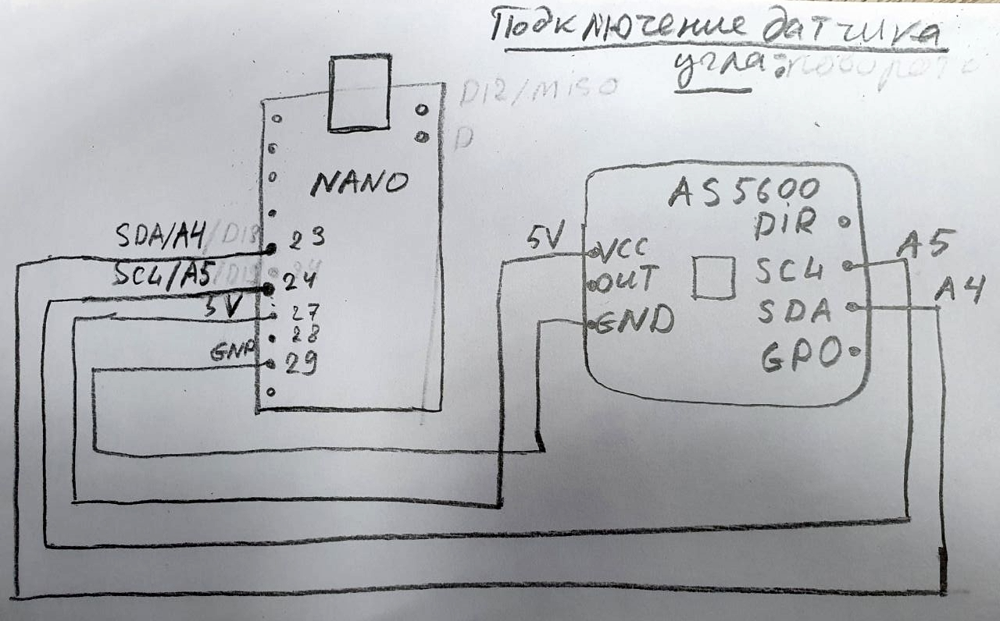

# Датчик угла поворота AS5600:

 


[Описание датчика](https://ams.com/documents/20143/36005/AS5600_DS000365_5-00.pdf)

[Библиотека работы с датчиком](https://github.com/kanestoboi/AS5600) 

Покупал [тут](https://aliexpress.ru/item/AS5600-magnetic-encoder-magnetic-induction-angle-measurement-sensor-module-12bit-high-precision/4000551682522.html?spm=a2g0s.9042311.0.0.264d33ed0SdIOG&_ga=2.229159834.721664696.1612051115-530682806.1605135245&_gac=1.220963690.1610796936.CjwKCAiAuoqABhAsEiwAdSkVVCUs5nTX80VVDpcnxLvB3kZpXs2zuaedRuR_P9vpGu__abLf1sHESBoCMw4QAvD_BwE&sku_id=10000002869296963), правдо есть одна особенность, **адрес I2c менять нельзя** на устройстве, и магниты в комплекте намагничены **в осевом направлении**.

## Схема подключения к arduino nano:

 



## Код получения данных угла:

В примере используеться библиотека [AS5600](https://github.com/kanestoboi/AS5600), библиотеку можно использовать только в приложениях **не требующих быстродействия,** т.к происходит большая задержка

```text
#include <AS5600.h>
#include <MedianFilterLib2.h>

static MedianFilter2<long> medianFilter(3);
AS5600 encoder;

long revolutions = 0;   // number of revolutions the encoder has made
double position, position_filtred, last_position_filtred  = 0;    // the calculated value the encoder is at
double output;          // raw value from AS5600
long lastOutput;        // last output from AS5600
double derivative;
bool _init = false;
double max_derivative = 0;

void setup() {
  Serial.begin(115200);

  output = encoder.getPosition();
  lastOutput = output;
  position = output;
}

void loop() {
  output = encoder.getPosition();           // get the raw value of the encoder                      
  
  if ((lastOutput - output) > 2047 )        // check if a full rotation has been made
    revolutions++;
  if ((lastOutput - output) < -2047 )
    revolutions--;

  position = (revolutions * 4096 + output)/4096. * 360;   // calculate the position the the encoder is at based off of the number of revolutions
  position_filtred = medianFilter.AddValue(position);

  if (_init) {
    double derivative = abs(position_filtred  - last_position_filtred);
//    if (derivative > max_derivative) {
      max_derivative = derivative;
//    }
  } else {
    _init = true;
  }

  last_position_filtred = position_filtred;
  Serial.println(position_filtred);

  lastOutput = output;                      // save the last raw value for the next loop 
}

```

## Пример получения позиции в асинхронном режиме:

В примере используеться  бибилиотека [AsyncI2CMaster](https://github.com/cskarai/asynci2cmaster) 

```text
#include <AsyncI2CMaster.h>
#define I2C_ADDRESS 0x36
#define RAWANGLEAddressMSB 0x0C
#define RESOLUTION 4096
#define HALF_RESOLUTION 2047

AsyncI2CMaster i2cMaster;


struct EncoderSate {
	unsigned long s_time;
	long revolutions;		// number of revolutions the encoder has made
	float position;		// the calculated value the encoder is at
	int lastOutput;			// last output from AS5600
	int counter;
};

static EncoderSate encoder_state = {millis(), 0, 0, 0, 0};


void dumpErrorStatus(uint8_t status)
{
	switch(status)
	{
		case I2C_STATUS_DEVICE_NOT_PRESENT:
			Serial.println(F("Device not present!"));
			break;
		case I2C_STATUS_TRANSMIT_ERROR:
			Serial.println(F("Bus error"));
			break;
		case I2C_STATUS_NEGATIVE_ACKNOWLEDGE:
			Serial.println(F("Negative acknowledge"));
			break;
		case I2C_STATUS_OUT_OF_MEMORY:
			Serial.println(F("memory not enought"));
			break;
	}
}

void requestCallback(uint8_t status, void *arg, uint8_t * data, uint8_t datalen) {
	if( status == I2C_STATUS_OK ) {
		//1. decode pos data:
		int output = (data[0] << 8) | (data[1]);
		// check if a full rotation has been made
		if ((encoder_state.lastOutput - output) > HALF_RESOLUTION ) {
			encoder_state.revolutions++;
		}
		
		if ((encoder_state.lastOutput - output) < -HALF_RESOLUTION ) {
			encoder_state.revolutions--;
		}
		encoder_state.lastOutput = output;

		// calculate the position the the encoder is at based off of the number of revolutions
		encoder_state.position = (encoder_state.revolutions * RESOLUTION + output) / float(RESOLUTION) * 360;
		// Serial.println(encoder_state.position);
		encoder_state.counter++;
		unsigned long c_time = millis();

		if (c_time - encoder_state.s_time >= 1000) {
			encoder_state.s_time = c_time;
			Serial.println(encoder_state.counter);
			encoder_state.counter = 0;
		}

		//1. request new position:
		uint8_t arg = RAWANGLEAddressMSB;
		if (i2cMaster.request(I2C_ADDRESS, &arg, sizeof(arg), 2, requestCallback, NULL) != I2C_STATUS_OK) {
			dumpErrorStatus(status);
		}
	} else {
		dumpErrorStatus(status);
	}
}

void setup() {

	Serial.begin(115200);
	Serial.println(F("Starting"));
	i2cMaster.begin();
	
	uint8_t arg = RAWANGLEAddressMSB;
	uint8_t status;
	if (status = i2cMaster.request(I2C_ADDRESS, &arg, sizeof(arg), 2, requestCallback, NULL) != I2C_STATUS_OK) {
		dumpErrorStatus(status);
	}
}

void loop() {
	i2cMaster.loop();
}


```

## Примеры работы:



## Протокол I2C:

[хорошая статья](http://easyelectronics.ru/interface-bus-iic-i2c.html) по описании физики и логики работы протокола

