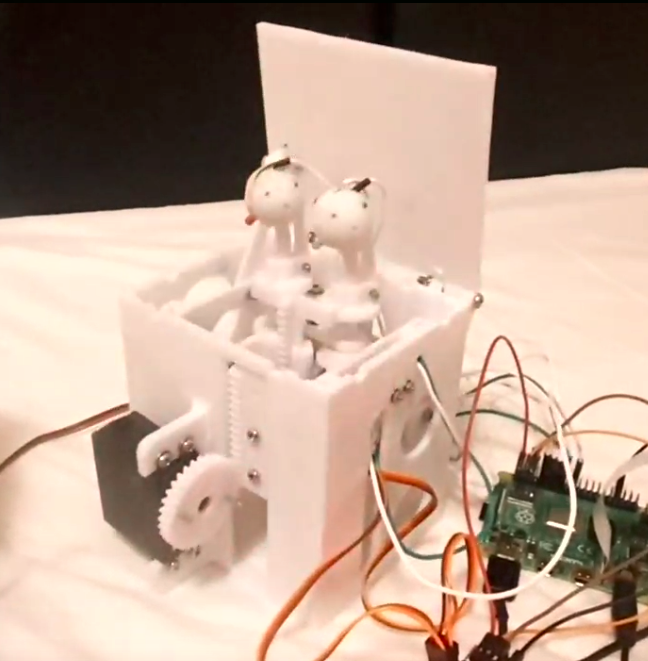

# Глаза

## Назначение глаз:

Сделать более привлекательной игру с кнопками:

1. Привлекать к игре: детекция игрока и заманивание играть
2. Озвучивание состояние нажатых кнопок.
3. Отвлечение игрока звуками и анимацией, чтобы отжать кнопки

## 3D модель глаз ([тут](https://cad.onshape.com/documents/22991d42a36e22d3e2ce4d8a/w/e82bc4625fd0478d95b63bac/e/9fd64059c321da49cb1706a3?renderMode=0\&uiState=6418e4f4b15fa14416f7e92f)):

<figure><figcaption></figcaption></figure>

## Модельки для печати тут:&#x20;



## Результат печати и сборки:

<figure><figcaption></figcaption></figure>

## [https://www.youtube.com/watch?v=v935FX3t\_GE](https://www.youtube.com/watch?v=v935FX3t\_GE)

## Набор тестовых скриптов и возможно основное FW вот [тут](https://github.com/AlexLexx706/eyes)

## Текущая электрическая ([ссылка для редактированя](https://lucid.app/lucidspark/39f16498-e214-49d0-b583-c0931b6df66b/edit?invitationId=inv\_a764d8e7-a1d5-476e-994c-74396b92bc16))

<figure><figcaption></figcaption></figure>
