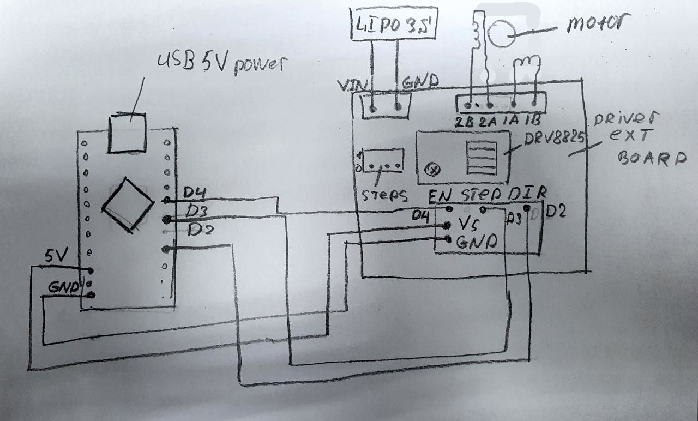

# Шаговый двигатель

## Текущая схема подключения  к ардуино Nano:

 



## Компаненты:

 


Брал плату [тут](https://aliexpress.ru/item/42-Stepper-Motor-Driver-Expansion-Board-DRV8825-A4988-3D-Printer-Parts-Control-Shield-Module-For-Arduino/4000772974580.html?spm=a2g0s.9042311.0.0.264d33ediNlWxI&_ga=2.65459752.721664696.1612051115-530682806.1605135245&_gac=1.195848926.1610796936.CjwKCAiAuoqABhAsEiwAdSkVVCUs5nTX80VVDpcnxLvB3kZpXs2zuaedRuR_P9vpGu__abLf1sHESBoCMw4QAvD_BwE&sku_id=10000007739648050)

 


Брал DRV8825 [тут](https://aliexpress.ru/item/3D-Printer-Parts-StepStick-DRV8825-Stepper-Motor-Driver-With-Heat-sink-Carrier-Reprap-4-layer-PCB/32618856994.html?spm=a2g0s.9042311.0.0.264d33ediNlWxI&_ga=2.65459752.721664696.1612051115-530682806.1605135245&_gac=1.195848926.1610796936.CjwKCAiAuoqABhAsEiwAdSkVVCUs5nTX80VVDpcnxLvB3kZpXs2zuaedRuR_P9vpGu__abLf1sHESBoCMw4QAvD_BwE&sku_id=59319975710)

## Документация:

1. [статья](https://darxton.ru/wiki-article/kontroller-shagovogo-dvigatelya/) по управлению шаговыми двигателями
2. [библиотека](https://github.com/adafruit/AccelStepper) управления шаговиком 
3. ещё [либа](https://alexgyver.ru/gyverstepper/)
4. [туториал по настройки драйвера](https://www.makerguides.com/drv8825-stepper-motor-driver-arduino-tutorial/)
5. [ещё](https://robotchip.ru/obzor-drayvera-shagovogo-dvigatelya-drv8825/) 

## Теория управления шаговыми двигателями:

1.  [https://www.embedded.com/generate-stepper-motor-speed-profiles-in-real-time/](https://www.embedded.com/generate-stepper-motor-speed-profiles-in-real-time/)
2. [https://www.researchgate.net/publication/322453861\_Generate\_stepper\_motor\_linear\_speed\_profile\_in\_real\_time](https://www.researchgate.net/publication/322453861_Generate_stepper_motor_linear_speed_profile_in_real_time)
3. 
## Пример программы управления:

```text
// Define stepper motor connections and steps per revolution:
#define DIR_PIN 2
#define STEP_PIN 3
#define ENABLE_PIN 4
#define STEPS_PER_REVOLUTION 200 * 3

void setup() {
	// Declare pins as output:
	pinMode(DIR_PIN, OUTPUT);
	pinMode(STEP_PIN, OUTPUT);
	pinMode(ENABLE_PIN, OUTPUT);

	digitalWrite(ENABLE_PIN, LOW);
}

void loop() {
	while (1) {
		// Set the spinning direction clockwise:
		digitalWrite(ENABLE_PIN, LOW);
		digitalWrite(DIR_PIN, HIGH);

		// Spin the stepper motor 1 revolution slowly:
		for (int i = 0; i < STEPS_PER_REVOLUTION; i++) {
			// These four lines result in 1 step:
			digitalWrite(STEP_PIN, HIGH);
			delayMicroseconds(20);
			digitalWrite(STEP_PIN, LOW);
			delayMicroseconds(1000);
		}
		digitalWrite(ENABLE_PIN, HIGH);
		delay(2000);

		digitalWrite(ENABLE_PIN, LOW);
		digitalWrite(DIR_PIN, LOW);

		// Spin the stepper motor 1 revolution slowly:
		for (int i = 0; i < STEPS_PER_REVOLUTION; i++) {
			// These four lines result in 1 step:
			digitalWrite(STEP_PIN, HIGH);
			delayMicroseconds(20);
			digitalWrite(STEP_PIN, LOW);
			delayMicroseconds(1000);
		}
		digitalWrite(ENABLE_PIN, HIGH);
		delay(2000);
	}
}

```


