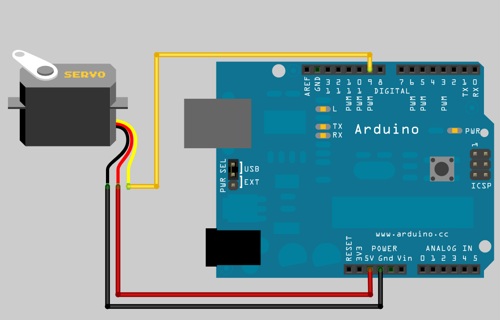

# Управление сервой

## Цвера проводов сервы:

 



## Пример кода '**посполезной коробки**':

```text
#include <Servo.h>

Servo myservo;	// create servo object to control a servo

void setup() {
	myservo.attach(5);	// attaches the servo on pin 5 to the servo object
	pinMode(9,INPUT_PULLUP);
	Serial.begin(115200);
}

void loop() {
	int sensorVal = digitalRead(9);
	Serial.println(sensorVal);
	if (sensorVal == HIGH) {
		delay(250);
		myservo.write(105);
		delay(700);
		myservo.write(0);
	}
}

```


